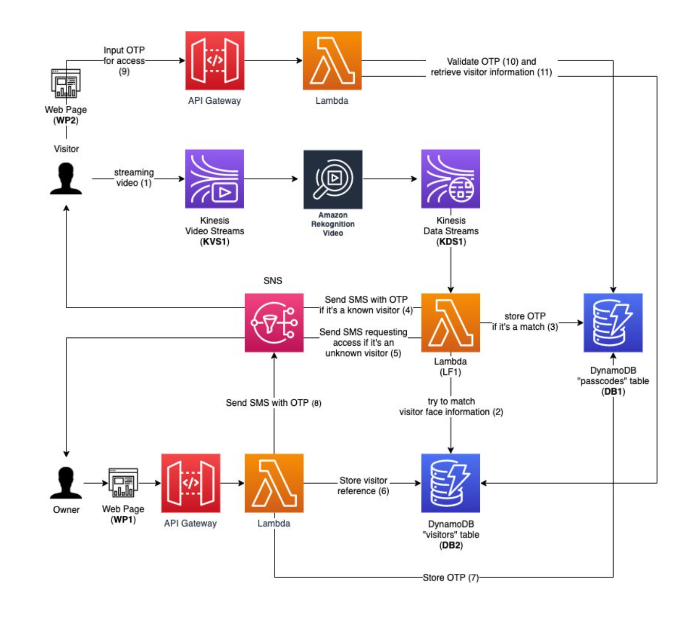

# Smart-Door-Authentication

Smart Door Authentication system uses AWS KInesis Video Stream and AWS Rekognition to authenticate and provide access to virtual door. We use GStreamer plugin to stream RTSP video stream from webcam on our computers. The Smart Door Authentication system detects faces in video stream and labels the faces if the person is present in the Database and sends OTP to the registered user using Amazon SNS. If the face does not match any person in the collection, owner receives a message with the image of the visitor and the owner can choose to allow the visitor by registering the visitor.


### Installing Gstream plugin
[Download and Configure the C++ Producer Library Code](https://docs.aws.amazon.com/kinesisvideostreams/latest/dg/producersdk-cpp-download.html)  
[Kinesis Video Streams Producer SDK GStreamer Plugin](https://docs.aws.amazon.com/kinesisvideostreams/latest/dg/examples-gstreamer-plugin.html#examples-gstreamer-plugin-download)  

Running the gst-launch-1.0 command to start streaming both audio and raw video in Mac-OS:  
```gst-launch-1.0 -v avfvideosrc ! videoconvert ! vtenc_h264_hw allow-frame-reordering=FALSE realtime=TRUE max-keyframe-interval=45 ! kvssink name=sink stream-name="my_stream_name" access-key="YourAccessKeyId" secret-key="YourSecretAccessKey" osxaudiosrc ! audioconvert ! avenc_aac ! queue ! sink.```


### Architecture Diagram


